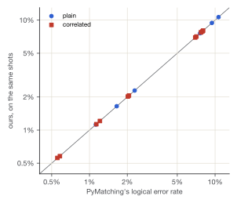
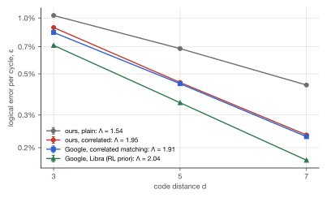
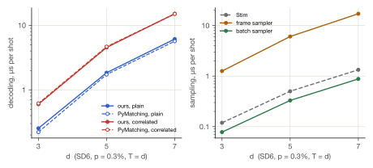
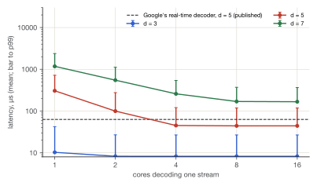
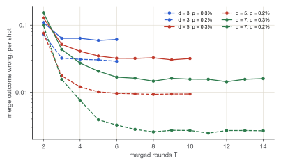

# Introduction

A surface code protects a logical qubit by measuring checks on many physical qubits, round after
round, and handing the outcomes to a decoder. The decoder infers which errors most likely occurred
and whether they flipped the logical qubit. Two questions decide whether it is any good:

- **Is it correct?** Is its error model the circuit's, and is its matching exact?
- **Is it fast enough?** A quantum computer produces a round every microsecond or so, and a decoder
  that falls behind never catches up.

This report describes an engine built to answer both. It covers how the engine works, how it is
checked, and what it measures. Every number below is read from a file committed with the source,
and the build fails if one is missing. The same engine drives an interactive explainer that runs
it in the reader's browser, at [qcompiler.jaspersands.com](https://qcompiler.jaspersands.com).

The work is organised around three references the field already trusts:

- **Stim** (Gidney, 2021) for circuits, error models and sampling;
- **PyMatching 2** (Higgott and Gidney, 2023) for matching;
- **Google's published recordings** from Willow (2024) and Sycamore (2022) for real hardware.

Where this engine and a reference can be made to compute the same thing, they are compared exactly.
Where they cannot, the comparison is statistical, with its uncertainty stated.

# The engine

## Circuits and error models

The engine reads and writes the part of Stim's circuit language that memory experiments use:

- resets, `H`, `CX` and `CZ`, and measurements;
- depolarizing and Pauli channels;
- detectors and observables with their coordinates, `SHIFT_COORDS`, and `REPEAT` blocks;
- for Google's circuits, sweep-controlled `CX` and the Pauli gates.

Two generators write rotated and XZZX memory experiments. One uses the engine's own circuit-level
noise; the other uses SD6, the standard model in which published thresholds are quoted.

A **detector error model** lists every independent fault and the detectors and observables it
flips. The engine builds one by walking the circuit backwards once. For each qubit it carries the
set of detectors that an X or a Z error there would flip, as Stim's error analyzer does. Matching
needs graph-like faults, so a fault that sets off more than two detectors is split into pieces.
The engine splits them the way Stim does: by what the rest of the same noise channel can express,
then by Stim's global pass. The first, simpler split looked right and was not (section 3).

## Sampling

There are two samplers:

- **The frame sampler** propagates a Pauli frame through the circuit one shot at a time. It never
  looks at the error model, so the model and the sampler can disagree, and the checks can see it.
- **The batch sampler** keeps 64 shots in each machine word: two words per qubit, one for X and
  one for Z. It draws noise as whole words by geometric skipping, so a location at $p = 10^{-3}$
  costs about one random number, not 64. It runs `REPEAT` blocks without flattening them, with
  measurement records in a ring buffer sized by the longest lookback. A million-round memory costs
  one round's instructions, and its detection events stream out as they are made.

## Matching

Each graph edge is weighted $\ln((1-p)/p)$, discretised to even integers, and decoded by **sparse
blossom**, the algorithm PyMatching 2 is built on (Higgott and Gidney, arXiv:2303.15933):

- Every defect grows a region on the detector graph at the same rate, and a region's radius is its
  dual variable.
- Collisions between regions are found by the growth itself.
- Edmonds' alternating trees and blossoms act on regions rather than on vertices.

The earlier dense matcher (Dijkstra from every defect, then blossom on the complete graph) stays
in the code as the sparse one's first oracle.

**Correlated matching** follows PyMatching 2.4's `enable_correlations=True`, read from its source,
so that PyMatching can serve as the oracle. A Y error sets off checks in both halves of the
detector graph, and the error model records it as two pieces that fire together. Plain matching
forgets that; correlated matching uses it in two passes:

1. **Match once.** Trace a shortest path for each matched pair into one edge set.
2. **Lower the weights.** For every edge in that set, lower the weight of each edge it shares a
   fault with to $\ln((1-p_a)/p_a)$. Here $p_a = \min(1/2,\ \mathrm{joint}(c, a)/\mathrm{marginal}(c))$
   is the probability that edge $a$ fired, given that edge $c$ did.
3. **Match again** on the lowered weights, and read off the prediction.

## Window decoding

A global decoder waits for the experiment to end. A **window decoder** matches a few rounds at a
time:

- It decodes a window of *commit* + *buffer* rounds and keeps the edges of its correction that
  touch the commit region.
- It toggles their far ends, so a correction reaching past the region leaves a defect for the next
  window.
- An edge leaving the window becomes a boundary half-edge of its own, kept apart from the real
  boundary. A defect near the window's end can then wait for a partner not yet seen.

There are two schedules:

- **Sliding** windows run one after another, so each stream uses one core.
- **Parallel** windows (Skoric et al., arXiv:2209.08552; Tan et al., arXiv:2209.09219) come in two
  layers. Layer A's windows are spaced apart, with virtual boundaries on both sides. Layer B's fill
  the gaps once A has committed. Each layer's windows are independent, so one stream can use many
  cores.

Correlated matching works inside a window: the second pass is traced on the lowered weights, and
the correlation rules are restricted to the window's edges.

**Streaming.** A million-round experiment has no error model that fits in memory, and none is
needed: a memory circuit repeats. The stream decoder builds the model of a short *template* once,
and gives each window of the stream the graph of the template window in the same position. The
first and last windows come from the template's ends, the bulk from its middle. Rounds are pushed
in as the batch sampler makes them, and a window is decoded as soon as its last round has arrived
and the windows it depends on are done. Once no window still needs a round, the round is dropped,
and any defect left in it is counted as unexplained.

## Where it runs

The same Rust runs natively, from Python (a PyO3 module, `pip`-installable as one abi3 wheel for
Python 3.9 on), and as WebAssembly in the browser. The page has no build step. It runs the engine
in a pool of web workers, one per core but one, at most eight. The engine is compiled once and
shared by every worker.

# How it is checked

The checks come in three layers, strictest first:

- **Exact oracles.** Where an answer is unique, it is checked exactly:
  - The sparse matcher's optimal weight must *equal* the dense matcher's and a brute-force
    search's, on random graphs and on sampled surface-code shots.
  - Every single fault of every circuit, decoded alone, must predict its own logical flip.
  - One window as long as the stream must reproduce the global decoder's traced correction.
  - The batch sampler must reproduce the frame sampler's shots when every channel is made
    deterministic.
- **References.** Stim's error models must equal ours, and PyMatching's matchings must tie ours.
  Google's detection events must equal those we rebuild from their raw measurements.
- **Statistics.** Where only a rate can be compared, the comparison states its interval:
  per-detector χ² between samplers, Wilson intervals on logical error rates, and parametric
  bootstrap intervals on Λ.

The layers have caught real defects. They are listed in full in the repository's README, and four
of them show what each layer is for:

- **A decomposition that passed every unit test.** It split wide faults into their X and Z halves.
  It agreed with Stim fault for fault, because that comparison is about faults, not pieces. But the
  exhaustive single-fault check found faults at d = 3 that it decoded into logical errors: a Y
  error on a boundary qubit, kept whole, became an edge bridging the two matching graphs. The fix
  reproduces Stim's decomposition exactly, and the matching graphs in section 4.2 are the result.
- **Refitting that biased the intervals.** A bootstrap that let each redrawn data set re-choose its
  own points and weights biased the redrawn fidelities about 0.2% low. Averaged over eighteen
  patches, that made the intervals lopsided. It was caught before anything was quoted: the
  intervals had come out asymmetric where they should not have.
- **Parallel windows with no buffer.** They were found to leave corrections nowhere to land. The
  every-defect-explained check found them, and they are now refused.
- **A stream count that could not fail.** Code review found that the stream decoder dropped rounds
  without counting the defects left in them, so its "unexplained" count was zero by construction.
  It now counts them. A test that skips a window shows the leftover defect counted (and fails on the
  old code), and the million-round run below was repeated with the working count.

# Results

## Thresholds

SD6 thresholds from repeated sweeps over d = 3 to 9, each fitted by finite-size scaling. The fit
includes the leading correction to scaling, over the widest window the scaling form describes,
chosen by reduced χ² ({{pth.runs}} independent sweeps per code; `data/sweeps/`):

{{table:thresholds}}

The "uncorrected crossing" is where the curves cross without the correction term, which small
patches pull low; the corrected fit is the threshold.

## Agreement with Stim and PyMatching

**Error models.** The comparison covers Stim's own generated rotated memory, and ours for both
codes under both noise models, at d = 3, 5 and 7 with $p = 0.3\%$. For {{xc.all_identical}} of
them, both models list the same faults with the same probabilities, and the decomposed matching
graphs are identical edge for edge:

{{table:models}}

**Plain matching.** Stim sampled 100,000 shots at each point, and both decoders decoded the same
detection events. Two exact matchers can disagree only where two corrections tie in weight. There
were {{xc.plain_disagree}} disagreements in {{xc.shots}} shots, and every one is a tie: the two
matchings' weights are equal to within the discretisation noise.

{{table:decoding}}

**Correlated matching**, on {{xc.corr_shots}} shots: {{xc.corr_disagree}} disagreements, and none
of them a bug. For each, PyMatching's own first-pass edges went into our second pass:

- in {{xc.corr_path_ties}} cases this reproduces PyMatching's answer, because the two first passes
  traced different, equally short paths;
- the other {{xc.corr_weight_ties}} tie PyMatching's second-pass weight;
- {{xc.corr_non_ties}} are neither.

Correlated matching fails {{xc.corr_failures}} times against plain matching's
{{xc.plain_failures}}, {{xc.corr_gain}} fewer.

{{table:correlated}}

{width=62%}

**Speed.** Single-threaded, our plain matcher takes {{xc.plain_ratio}} times PyMatching's time per
shot, and our correlated matcher {{xc.corr_ratio}} times PyMatching's correlated mode.
PyMatching's C++ has had years of tuning that this matcher has not. The gap is a roughly constant
factor that does not grow with d, as the figure below shows.

## Google's hardware

Google has published everything its chips recorded in two surface-code memory experiments:

- **Willow** (2024): d = 3, 5 and 7, 1 to 250 rounds;
- **Sycamore** (2022): d = 3 and 5, 1 to 25 rounds.

The data comes as raw measurements, sweep bits, circuits, error models and each of Google's
decoders' predictions. Both datasets are CC BY 4.0, from Zenodo records 13273331 and 6804040.

**Reading the chips' output.** A detector compares a parity of measurements with what a noiseless
run gives. The engine runs the ideal circuit once on its stabilizer tableau to get that reference,
and once more per sweep bit to get each bit's effect. This is independent of the backward walk that
builds error models. Over all {{g.experiments}} experiments and {{g.shots}} shots:

- the detection events and observable flips rebuilt from raw measurements equal Google's **bit for
  bit** ({{g.m2d_exact}} of {{g.experiments}} experiments);
- our model of every noisy circuit is identical to Stim's ({{g.models_same}} of
  {{g.experiments}}).

**One fit, Google's.** Λ is fitted the way Google fits it:

1. **Per patch and basis,** the logical fidelity $1 - 2P_L$ is fitted as $A(1-2\varepsilon)^r$ by
   weighted least squares on its logarithm, from round 10 for Willow and round 3 for Sycamore.
2. **Per distance,** ε is the mean over patches and bases.
3. **Λ** is $\exp(-2\,\mathrm{slope})$ of a line through $\ln \varepsilon$ against $d$.
4. **Intervals** come from a parametric bootstrap with 400 draws.

As validation, Google's own tensor-network predictions for Sycamore, fitted this way, give
ε₃ = {{val.e3}} and ε₅ = {{val.e5}}. The published values are {{val.pub3}} and {{val.pub5}}:
the same, to the digits published.

{{table:willow}}

{width=82%}

- **Correlated matching is most of the story.** With the same prior, it takes Λ from
  {{w.plain.l}} to {{w.corr.l}}, and ε at d = 7 from {{w.plain.e7}} to {{w.corr.e7}}.
- **Ours sits beside Google's own correlated matcher** on the same prior, {{w.corr.e7}} against
  {{w.gcorr.e7}} at d = 7. It is further behind at d = 3 ({{w.corr.e3}} against
  {{w.gcorr.e3}}), which is why its Λ comes out higher: Λ rewards improving with size, not being
  good.
- **Our own model of the noisy circuit**, built from Google's circuit with no fitting to the data,
  does about as well as Google's fitted SI1000 prior ({{w.own.e7}} at d = 7).
- **Google's best decoders are better still.** Libra reaches Λ = {{w.libra.l}} and ε₇ =
  {{w.libra.e7}}. The published neural-network decoder's 2.14 cannot be refitted here: its
  predictions are not in the dataset.

{{table:sycamore}}

On Sycamore, our plain matcher reproduces the PyMatching predictions Google recorded
({{s.plain.e3}} against {{s.pm.e3}} at d = 3). The two disagree on {{g.syc_disagree}} shots over
the whole dataset. On every one of them, our matching's weight equals the optimum PyMatching 2.4
finds ({{g.syc_not_optimal}} are not optimal): these are ties, broken differently by the older
PyMatching that Google used. Sycamore's Λ ≈ 1 was that paper's point, the first time a larger
surface code beat a smaller one at all, and only with the best decoders.

## Belief-matching

Matching weighs every graph edge by its prior alone. **Belief-matching** (Higgott, Bohdanowicz,
Kubica, Flammia and Campbell, PRX 13, 031007, 2023) works in three steps:

1. **Belief propagation** runs over the whole error model: every fault a variable, every detector
   a check, nothing split into pieces.
2. **The graph is re-weighted.** Each edge gets $-\ln p$, where $p$ is the sum of the posteriors of
   the faults whose decomposition contains it.
3. **The sparse matcher decodes** on those weights. Where BP converges by itself, its own correction
   is the answer.

The implementation is written to reproduce the authors' package, `beliefmatching`, and the BP
library it runs on, `ldpc`, step for step. Both are checked exactly:

- **BP.** Over {{bp.cases}} syndromes in {{bp.configs}} configurations, the largest difference
  between our posterior log-likelihood ratios and `ldpc`'s is {{bp.max_diff}}. The configurations
  cover random matrices and a surface code's hypergraph, product-sum and min-sum, and 1 to 20
  iterations. {{bp.bad}} hard decisions, convergence flags or iteration counts differ.
- **Belief-matching.** Over {{bm.shots}} shots of SD6 memories at d = 3, 5 and 7, it disagrees with
  `beliefmatching` on {{bm.disagree}} shots, and BP's convergence differs on {{bm.conv_differ}}.
  Single-threaded at d = 7 it takes {{bm.speed}} a shot; the reference rebuilds a matching graph for
  every shot.

**Sycamore**, every shot, with the data-fitted priors cross-fitted as Google used them, against
Google's own recorded belief-matching:

{{table:belief_sycamore}}

- **d = 5 beats d = 3.** Ours gives Λ = {{bs.ours.lambda}}, Google's {{bs.google.lambda}}.
- **Close, but not the same.** Ours agrees with Google's predictions on {{bs.agree}} of
  {{bs.shots}} shots and fails {{bs.more}} more often. Google's BP settings are not in the dataset,
  and more iterations do not close the gap.

**Willow**, on the first {{bw.shots}} shots of each of {{bw.experiments}} experiments. BP on
Willow's longest experiments costs about 25 ms a shot even on ten cores, so there are fewer shots.
Every decoder in this table is scored on the same shots:

{{table:belief_willow}}

- **Belief-matching wins small and loses large.** At d = 3 it beats every matcher in the table
  ({{bw.belief.e3}}, against {{bw.corr.e3}} for our correlated matcher and {{bw.gcorr.e3}} for
  Google's). At d = 7 it is worse ({{bw.belief.e7}} against {{bw.corr.e7}}), so its Λ,
  {{bw.belief.lambda}}, falls below correlated matching's {{bw.corr.lambda}}.
- **Longer BP does not change it.** On the same shots at d = 7, {{bi.d7.rounds}} rounds,
  belief-matching fails {{bi.d7.b20}} times with 20 iterations and {{bi.d7.b100}} with 100, against
  correlated matching's {{bi.d7.corr}}. BP settles alone on {{bw.converged}} of Willow's shots.
- **On Sycamore it is among the best.** Those experiments run at most 25 rounds with priors fitted to
  the data, and belief-matching is one of the two best decoders there, Google's and ours alike.

## Throughput

Sampling speed per shot, single-threaded, rotated SD6 with T = d. Stim is timed through its Python
API, compiled beforehand and writing packed bits; ours includes transposing batches into Stim's
b8 layout:

{{table:sampling}}



The batch sampler is {{speed.batch_vs_frame}} times as fast as the frame sampler, and faster than
Stim's as called from Python. Decoding, not sampling, is now almost all of a shot's cost.

On the page, work is split across a pool of workers. On the development machine the site's
section 7 threshold sweep ran {{readme:2.5 to 4.4 times faster}} with the pool than with one worker; the
spread comes from whether workers land on performance or efficiency cores.

## Real time

Willow runs a round of error correction every {{rt.cycle}}. Google has decoded a d = 5 memory in
real time over a million rounds with a 63 µs mean latency (arXiv:2408.13687), on its own hardware
and with its own definition of latency. Here, every window's decode time is measured natively on
{{rt.machine}}, one core at a time. Those times are then scheduled with rounds arriving every
{{rt.cycle}}:

- A window starts once its last round has arrived and, for layer B, both its layer-A neighbours are
  done.
- **Latency** is the time from the arrival of a window's last round to its commit.
- A stream **keeps up** if its latency does not grow along it.

The windows commit d rounds with a buffer of d. The streams are Willow's recorded syndromes, 2,000
shots at each of d = 3, 5 and 7, at 250 rounds, decoded with Google's SI1000 prior:

{{table:latency}}

{width=82%}

- **Sliding windows** keep up only at d = 3, with either matcher. Everywhere else one core is too
  slow, which is why parallel windows exist.
- **At d = 5, parallel windows with correlated matching keep up on {{rt.d5.cores}} cores** with a
  {{rt.d5.mean}} mean latency. At d = 7 they need {{rt.d7.cores}}.

**A million rounds.** The stream is a rotated d = 5 memory under SD6 at *p* = {{m.p}}, the noise
at which its detectors fire as often as Willow's do ({{m.frac}} of detectors a round). There are
{{m.streams}} streams of {{m.rounds}} rounds each, sampled round by round and decoded as they
arrive:

{{table:million}}

- **Every defect of every stream is explained** ({{m.unexplained}} left, counted as rounds are
  dropped).
- **Correlated matching on {{m.corr.cores}} cores holds a {{m.corr.mean}} mean latency** ({{m.corr.p99}} at
  the 99th percentile) over a million rounds.
- **Throughput.** On all {{m.tput.cores}} cores, independent streams decode at {{m.tput.plain}}
  rounds a second with plain matching and {{m.tput.correlated}} with correlated. Willow's cycle
  demands {{m.willow_rate}} a second per stream.

**Accuracy.** Windowing costs nothing in Λ. The run covers {{win.experiments}} Willow
experiments (all but the single-round ones, which have nothing to window), {{win.shots}} shots
each. Every one was decoded globally and by sliding and parallel windows, fitted as above:

{{table:windows}}

- **Correlated matching gives the same Λ either way:** {{win.corr.lambda}} for parallel windows,
  {{win.global.lambda}} globally.
- **A buffer of d/2 is too short.** It raises ε₅ by {{win.half_cost}}, while a buffer of 2d gains
  nothing over d.
- **Simulated SD6 agrees.** At d = 3, 5 and 7, $p = 0.3\%$ and $0.5\%$, 50 rounds and
  {{win.sd6_shots}} shots, every window decoder's failures are within {{win.sd6_worst}} of the
  global decoder's on the same shots.
- **No defect was left unexplained** ({{win.unexplained}} over every Willow run).

## Beyond the surface code: the gross code

IBM's bivariate bicycle codes (Bravyi et al., *Nature* 627, 778, 2024) keep many logical qubits in
one block. The **gross code**, $[[144, 12, 12]]$, stores 12 at distance 12 on 144 data and 144 check
qubits. Its checks have weight six, and a single fault sets off several at once, so it cannot be
matched. It is decoded by **BP+OSD**: belief propagation, and where BP fails to settle, ordered-
statistics decoding, which solves the syndrome equation on the faults BP trusts least.

The engine builds the code and its logical operators over GF(2), and the paper's Z-basis memory
from the depth-8 syndrome cycle in the paper's own simulation code. Each piece is checked
against something independent:

- **The check matrices** equal ones built as Bravyi et al.'s code builds them, and $k = 12$.
- **Without noise every detector is deterministic.** This is what shows that the reconstructed
  schedule measures the stabilizers.
- **The error model equals Stim's** for {{g.model_mechanisms}} faults at 12 cycles.
- **BP+OSD equals `ldpc`'s.** Over {{g.osd_shots}} shots, {{g.osd_same}} corrections equal those of
  `ldpc`'s `BpOsdDecoder`, for OSD-0 and OSD-CS of order 7, with its adaptive min-sum scaling. Making
  that exact meant ordering tied posteriors the way `ldpc` does. Min-sum run long enough repeats
  values, and one tied pair in 300 shots changed which columns OSD-CS paired up.

The Z memory runs 12 cycles for the gross code and 6 for $[[72, 12, 6]]$. A shot fails if any
logical qubit does, and the decoder is the paper's: BP+OSD-CS of order 7, with up to 10,000 BP
iterations.

{{table:gross}}

![Logical error per syndrome cycle of the gross code and [[72, 12, 6]] against physical error, BP+OSD-CS (solid) and BP+OSD-0 (dashed), beside 12 unprotected qubits.](figures/gross.svg){width=82%}

**Beside the surface code.** Twelve rotated $d = 11$ surface-code patches hold the same 12 logical
qubits on 2,892 qubits, ten times as many. The comparison measures them the same way: a Z memory
of 12 rounds at the same p, decoded by correlated matching.

{{table:gross_vs_surface}}

With a tenth of the qubits the gross code fails {{g.ratio_range}} times less often, at every p
measured. SD6 also puts noise on the surface code's Hadamards, which the bivariate bicycle circuit
does not use, so the comparison slightly favours the gross code.

## Lattice surgery

Two patches interact by **lattice surgery**:

1. **Merge.** The checks across the seam between the patches are measured for T rounds.
2. **Read the product.** The product of the new checks along the seam is the joint parity, here
   $Z_1 Z_2$.
3. **Split.** The patches are split again.

The engine writes the whole experiment as one circuit: prepare, merge, split, read out. One rule
places its detectors, even where checks change shape at the merge and the split. Without noise
every detector and observable is deterministic. The error model equals Stim's fault for fault, and
split for split, and every disagreement with PyMatching is a tie.

With one merged round, the error-model builder refuses the circuit, because a single measurement
error on a seam check flips the outcome with nothing after it to notice. With three, every single
fault is corrected.

**The timing law.** Here is how often the merge outcome is wrong, against the number of merged
rounds T:

{{table:surgery}}

{width=82%}

- **T = 2 is a trap that grows with the code.** A pair of measurement errors on one seam check
  flips the outcome unseen, and a bigger code has more seam checks.
- **By T = d the curve has flattened.** The merge outcome then fails about as often as a single
  patch of the same size. This is the textbook "d rounds per lattice surgery", measured, and it is
  the clock the resource estimate below uses.

**Programs.** The engine compiles lattice-surgery programs: patches on a grid of tiles, merged
along a line (side by side to measure Z⊗Z, one above the other for X⊗X), split and read out, under
the same detector rule. Observables are written as terms (a patch's logical along a line, a merge's
outcome, a merge's seam records), and the reference simulation checks every one is deterministic.
The Z⊗Z experiment above is one such program, and compiles to the same circuits byte for byte.

The **logical CNOT** puts control C, an ancilla A in $|+\rangle$ and target T in an L.

1. $Z_C Z_A$ is measured ($m_1$).
2. $X_A X_T$ is measured ($m_2$).
3. A is read out in Z ($m_3$).

The Pauli corrections the outcomes fix are tracked, not applied. Four checks mattered:

- **A refused frame.** The reference simulation refused a first frame for the $|+\rangle|+\rangle$
  inputs. $m_2$ reads X on A's last row, so $X_C X_A$ must be taken along that row.
- **A stale comparison.** A second merge exposed a detector-rule case: a seam check measured again
  after skipping rounds compared itself with a stale value. It now starts over.
- **The action, not just the error rate.** $|0\rangle|0\rangle$ and $|+\rangle|+\rangle$, the
  inputs the error rates use, are left alone by the identity too. Three more noiseless programs pin
  the gate: $|+\rangle|0\rangle$ must come out a Bell pair, $Z_C Z_T$ and $X_C X_T$ each fixed once
  the frame is applied, and $|0\rangle|+\rangle$ must come out unchanged. With the two above, this
  fixes the images of $Z_C$, $Z_T$, $X_C$ and $X_T$ as a CNOT's, up to signs, and $Z_T$ alone after
  $|+\rangle|0\rangle$ is refused as random.
- **A line is not a product.** Three patches merged in a row become one patch holding one logical
  qubit, so the merge measures $Z_1 Z_2$ and $Z_2 Z_3$, two parities, not the product
  $Z_1 Z_2 Z_3$. A first version called it a product; review caught it, and each seam now has its
  own outcome. A true product needs an ancilla region along every patch.

Every program's error model equals Stim's fault for fault, and every single fault of each is
corrected at d = 3.

{{table:surgery_cnot}}

- **Cheaper than holding the patches.** The CNOT fails {{ls.cnot_ratio}} times as often as its
  three patches held as memories for its 4d rounds. The resource estimate's model, every patch
  exposed for every operation, is if anything pessimistic.
- **Merges add up.** $k$ Z⊗Z measurements in a row fail with $\ln(1-P)$ linear in $k$: each merge
  adds the same risk, the sum-of-parts law an estimate assumes.
- **Three in a row.** Three patches merged at once, measuring $Z_1 Z_2$ and $Z_2 Z_3$ together, fail
  {{ls.line3}} at d = 3, 5, 7 and p = 0.3%.

{{table:surgery_seq}}

## What it would take

Each section above measures one ingredient of a quantum computer's cost, and a simple model puts
them together:

- Logical error per cycle falls from the measured $\varepsilon_7$ by Λ for every two steps of
  distance.
- Every operation is a lattice-surgery step of d merged rounds, with every patch exposed, so it
  fails with probability about $N d\,\varepsilon_d$. The measured CNOT fails {{ls.cnot_ratio}} times
  as often as its patches held idle for as long, so this errs on the safe side.
- The distance is the smallest odd one that keeps the run within a 1% budget.
- The qubits are $N(2d^2 - 1)$ with a routing overhead of 2.
- The time is d cycles of 1.1 µs per operation.
- The decoding cores are those measured to keep real time at d = 3, 5 and 7, extrapolated.

The sizes are illustrations of scale:

{{table:estimate}}

At Willow's measured Λ, a thousand logical qubits running a billion operations would need
d = {{est.medium.d}}, {{est.medium.qubits}} physical qubits and {{est.medium.time}}. At Λ = 4 the
same run needs d = {{est.lever.d}} and {{est.lever.qubits}}. Λ is the lever. The decoders measured
here, which differ by about 10% in Λ, move the answer far less than the hardware could.

# Limits and next steps

- **The matcher.** It is exact, and single-threaded it runs at {{xc.plain_ratio}} times
  PyMatching's time plain and {{xc.corr_ratio}} times correlated. Correlated matching closes most of the gap to Google's
  correlated matcher, but Google's Harmony and Libra decoders do better still.
- **Latency is scheduled, not served.** The latency figures schedule decode times measured
  natively on one machine. They leave out the transport of syndromes from a quantum computer to
  the decoder, and they are not a claim about any particular control system.
- **Memories and one operation.** The gross code is simulated as a memory, and lattice surgery as a
  single Z⊗Z measurement between two patches. Logical operations on the gross code, and sequences
  of surgeries, are the next step up.
- **The estimate is a model.** It takes lattice surgery as the only operation, ignores magic-state
  distillation and routing in detail, and extrapolates the decoding cost past d = 7. It is meant to
  show what the measured numbers imply, and how strongly they depend on Λ.

# Reproducing everything

Every number in this report is filled in by `tools/report.py` from these committed files:

- `data/xcheck/reference.json`: the cross-check;
- `data/sweeps/`: thresholds;
- `data/google-results/`: Google's data, decoded;
- `data/realtime/`: latency, the million-round stream, and windowed accuracy.

The report fails to build if a value it quotes is missing. To regenerate the data:

```bash
python3 -m venv .venv && .venv/bin/pip install stim pymatching numpy maturin
VIRTUAL_ENV=$PWD/.venv CARGO_TARGET_DIR=target-py .venv/bin/maturin develop --profile python
.venv/bin/python tools/xcheck.py                       # Stim and PyMatching
.venv/bin/python tools/google.py run                   # Google's data (fetch it first)
.venv/bin/python tools/realtime.py latency             # window latency on Willow
.venv/bin/python tools/realtime.py million             # a million rounds
.venv/bin/python tools/realtime.py accuracy            # windowed against global
node tools/lambda.mjs                                  # every fit
python3 tools/report.py                                # this report
```

The package installs with `pip install stabilizer-qec` once published, or from a wheel built by
`maturin build`. Software: Stim {{stim}}, PyMatching {{pymatching}}. Google's datasets are
CC BY 4.0 (Google Quantum AI; Zenodo 13273331 and 6804040); the engine is MIT-licensed.
